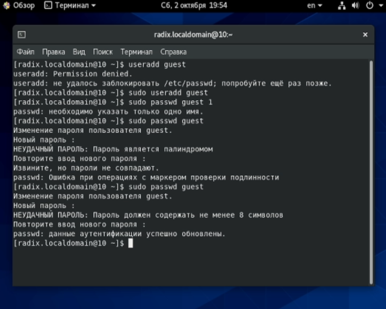
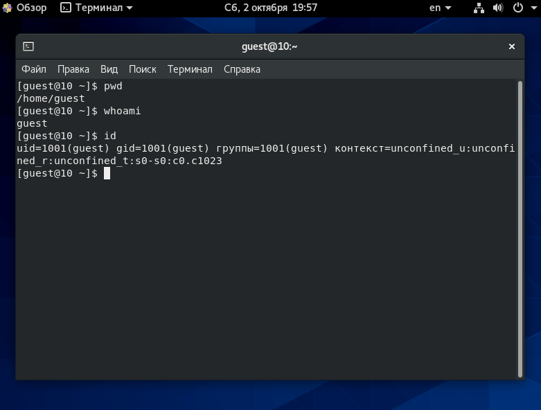
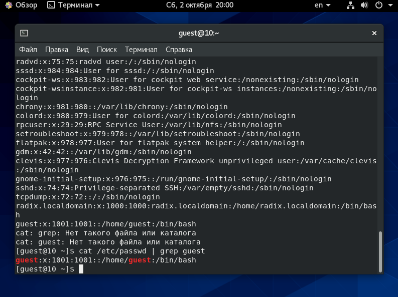
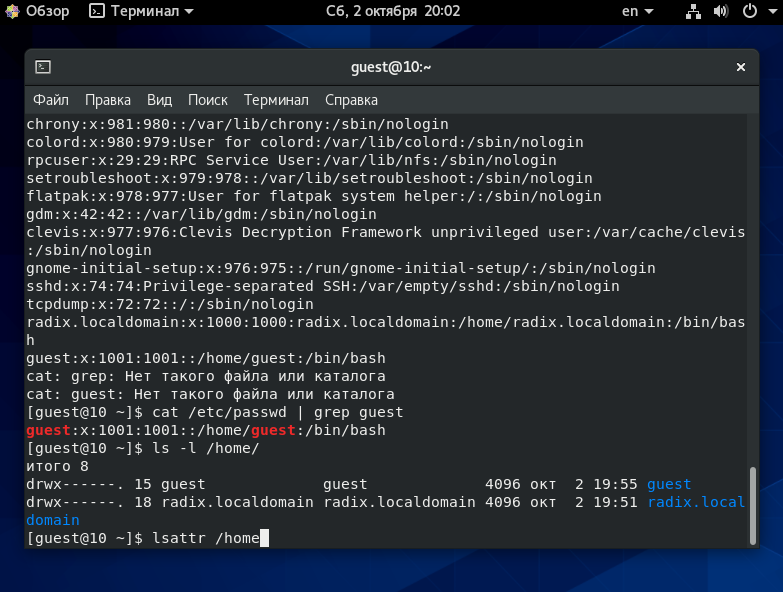
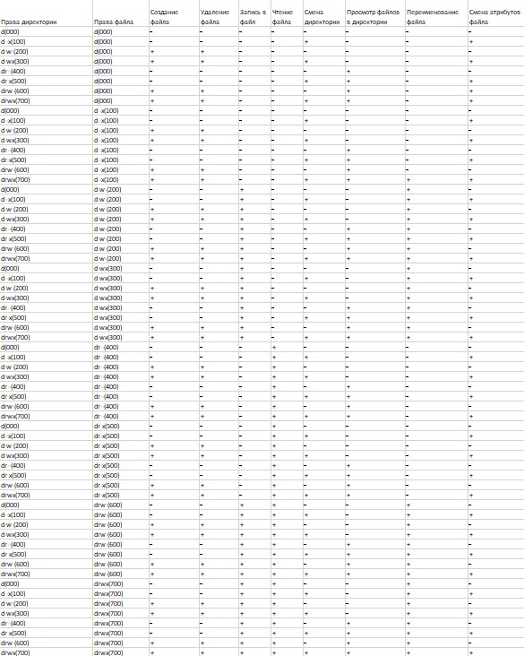
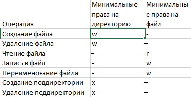

---
## Front matter
title: Лабораторная работа №2. Дискреционное разграничение прав в Linux. Основные атрибуты
author: [Радикорский Павел Михайлович, НФИбд-03-18]
institute: "RUDN University, Moscow, Russian Federation"
date: 02.10.2021
lang: "ru"
## Formatting
toc: false
slide_level: 2
theme: metropolis
mainfont: PT Serif
romanfont: PT Serif
sansfont: PT Sans
monofont: Consolas
header-includes:
 - \metroset{progressbar=frametitle,sectionpage=progressbar,numbering=fraction}
 - '\makeatletter'
 - '\beamer@ignorenonframefalse'
 - '\makeatother'
aspectratio: 43
section-titles: true

---
# Цели и задачи

## Цель

Получение практических навыков работы в консоли с атрибутами файлов, закрепление теоретических основ дискреционного разграничения доступа в современных системах с открытым кодом на базе ОС Linux

## Задачи

Лабораторная работа подразумевает создание гостевого пользователя, изменение и анализ прав на папки и файлы.

# Выполнение

## Процесс выполнения

В установленной при выполнении предыдущей лабораторной работы операционной системе создаём учётную запись пользователя guest, задаём пароль
    
{ #fig:001 width=70% }

## Процесс выполнения

Входим в систему через пользователя guest, проверяем директорию и уточняем имя пользователя. При сравнении группы получаем совпадение
    
{ #fig:001 width=70% }

## Процесс выполнения

Просматриваем файл /etc/passwd, находим свою учётную запись, при сравнении uid и gid получаем совпадение

{ #fig:001 width=70% }

## Процесс выполнения

Определили существующие в системе директории. Удалось получить список, в котором полные права на доступ есть только у владельцев поддиректорий

{ #fig:001 width=70% }

## Процесс выполнения

Проверяем расширенные атрибуты. Получаем, что мы видим расширенные атрибуты только своей директории, но не остальных пользователей

{ #fig:001 width=70% }

## Процесс выполнения

Создали директорию dir1, сняли с директории все атрибуты. Проверили правильность выполнения команды

{ #fig:001 width=70% }

## Процесс выполнения

Попытались создать в dir1 файл, получили отказ, связанный с отсутствием прав. То же самое произошло при попытке проверки наличия файлов в dir1.

{ #fig:001 width=70% }

## Процесс выполнения

Заполнили таблицу «Установленные права и разрешённые действия», выполняя действия от имени владельца директории (файлов), определив опытным путём, какие операции разрешены, а какие нет

{ #fig:001 width=70% }

## Процесс выполнения

На основании заполненной таблицы определили те или иные минимально необходимые права для выполнения операций внутри директории dir1

{ #fig:001 width=70% }

# Выводы

На основании выполненной лабораторной работы были получены практические навыки работы в консоли по изменению атрибутов файлов и папок